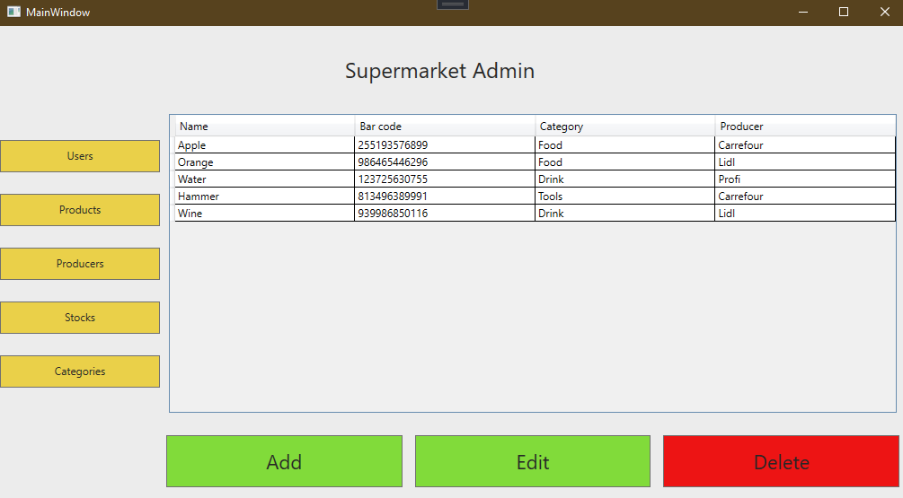

# Supermarket Management System

## Table of Content:

- [About The App](#about-the-app)
- [Screenshots](#screenshots)
- [Technologies](#technologies)

## About The App
The Supermarket Management System is a WPF application designed to streamline the operations of a supermarket. Utilizing the MVVM (Model-View-ViewModel) architecture, this application ensures a clean separation of concerns, promoting maintainability and testability. The application leverages the Entity Framework with a Database First approach to interact with the underlying database, providing robust data management capabilities. The database is created by me using Sql Server.

## Screenshots

### Log in page

### Admin page

### Cashier page

## Technologies
### Core Technologies
- .Net Framework
- C#
### User Interface
- WPF
### Data Access
- Entity Framework
### Database
- Sql Server